# Transformaciones
## Transform 1: Json Input con Select Values transformation

### 1. Input (Entrada)
Para la primera transformación se utilizó el paso **JSON input**. 

* **Configuración técnica:** Se cargó el archivo fuente y se configuraron los campos en la pestaña *Fields*. 

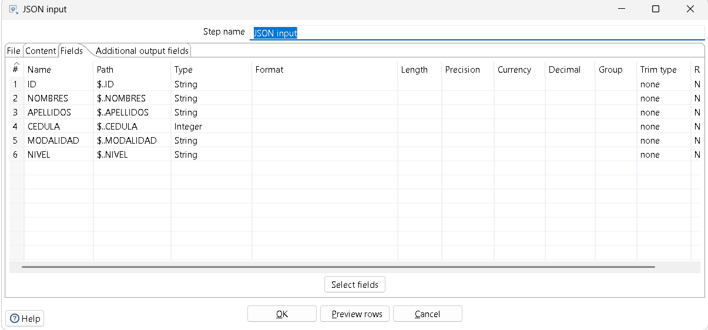

### 2. Transform (Transformación)
Se utilizó el paso **Select values** para la limpieza y normalización de los metadatos.

* **Conversión de tipos:** Se accedió a la pestaña *Meta-data* para transformar el campo **CEDULA**. Originalmente detectado como numérico (Integer), se forzó a tipo **String** (Texto)

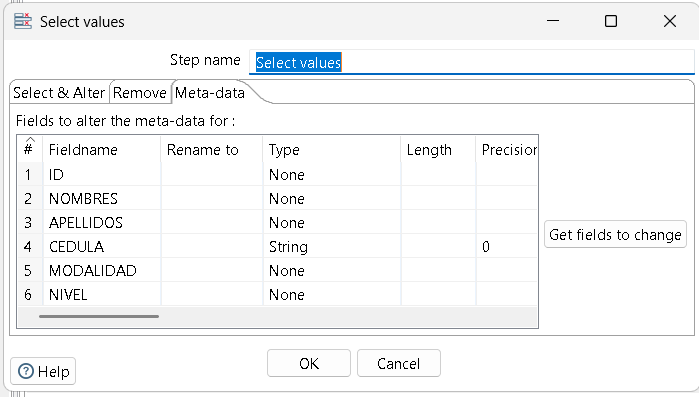

### 3. Output (Salida)
Como destino final se configuró el paso **JSON output**.

* **Consolidación:** Para evitar que el sistema generara archivos individuales por cada fila de datos, se configuró el parámetro **"Nr of rows in a block"** en **0**. Esto permite que todos los registros se agrupen en un único array dentro de un solo archivo de salida.

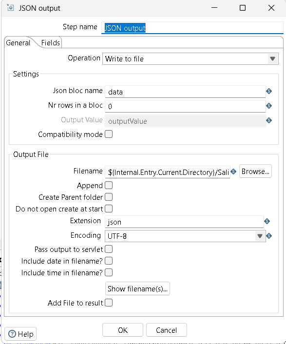
### 4. Resultado
La transformación toma un archivo JSON crudo, corrige las rutas de acceso, normaliza la identificación del estudiante (cédula) a texto y genera un archivo final consolidado y listo para ser utilizado en el Taller de Business Intelligence.

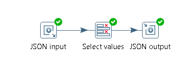

## Transform 2: CSV con mapper transformation

### 1. Input (Entrada)
Para esta transformación se utilizó  el formato **CSV file input**.
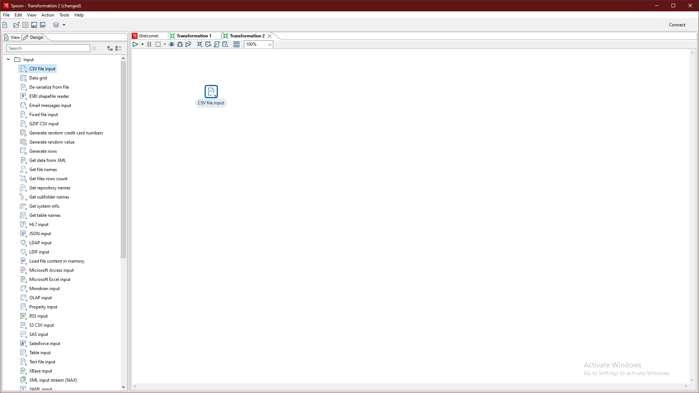
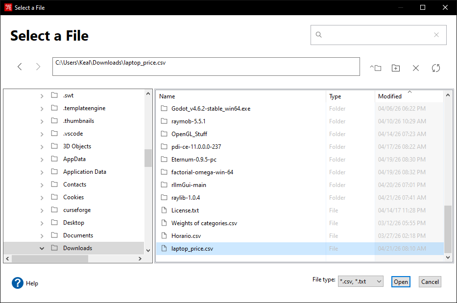

### 2. Transform (Transformación)
* **Conversión de datos**: En el campos de entrada ingresamos los valores que se encuentran dentro del archivo, y en el de salida con los valores que queremos reemplazar

### 3. Output (Salida)
* **Comparación de los resultados**:

## Transform 3: Generación de datos de prueba con identificador secuencial y valores aleatorios exportados a archivo txt

### 1. Input (Entrada)
Para esta transformación se utilizó  el formato **Generate Rows** este módulo genera filas artificiales que son necesarias para el flujo de la transformación.

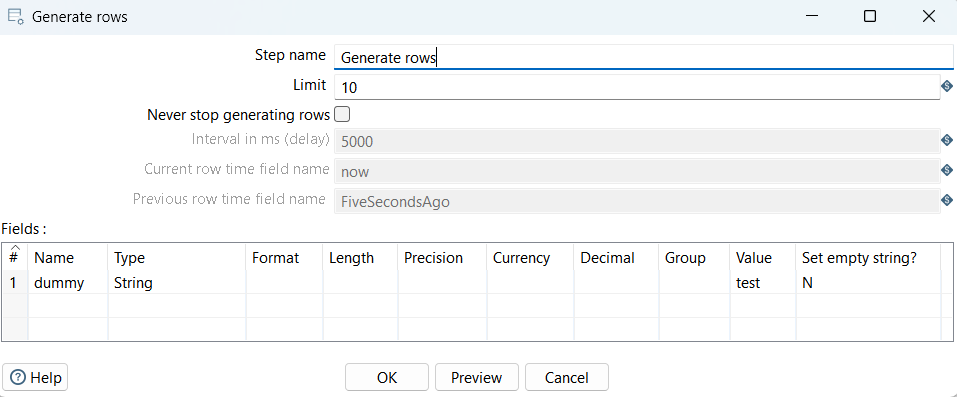

### 2. Transform (Transformación)
* **Add Sequence**: Se añade el modulo de add sequence para agregar una secuencia de datos con un identificador único incremental, donde el valor inicial es 1 y el incremento es 1.
* **Generate Random Value**: Este módulo genera valores aleatorios que se agregan a cada fila, Cada registro contiene un valor aleatorio diferente, útil para pruebas o simulaciones. El tipo de dato del valor aleatorio es interger.

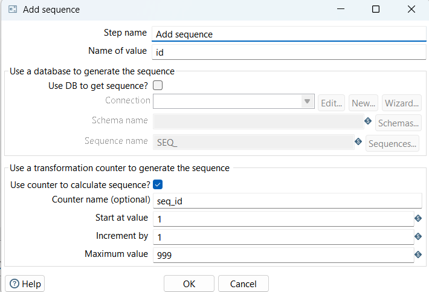
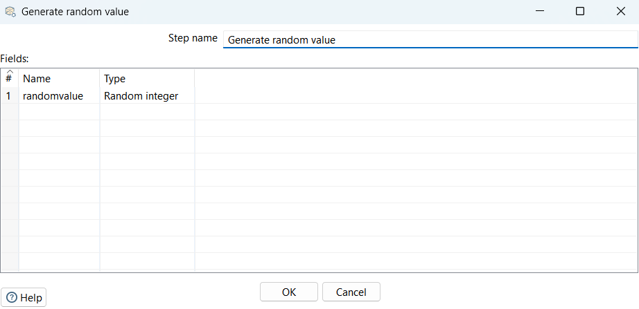

### 3. Output (Salida)
* **Text File Output**: Este módulo exporta los datos procesados a un archivo en formato txt.
* **Configuración:**
- Nombre del archivo: `${Internal.Entry.Current.Directory}/output_datos`
- Extensión: `txt`
- Separador: `,`
- Encabezado: Activado

**Campos exportados:**
- `id`
- `dummy`
- `valor_random`
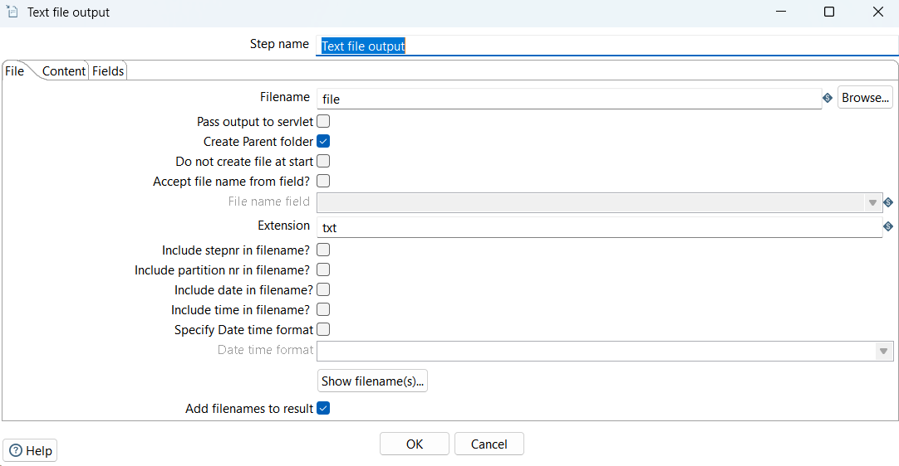
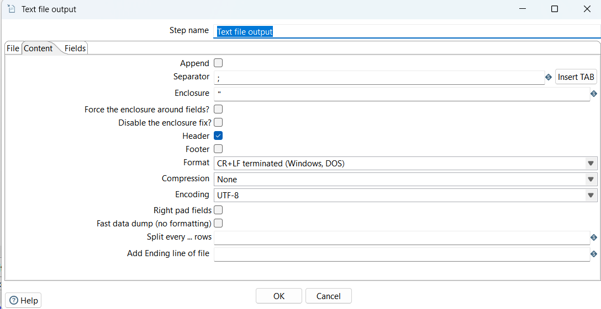
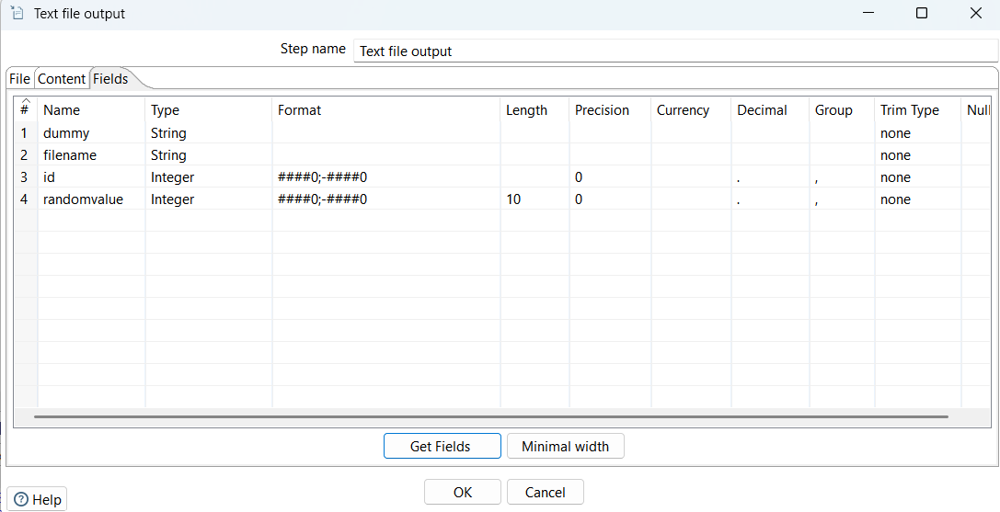
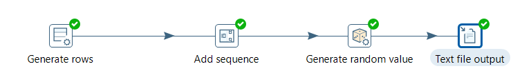

* **Reaultados Obtenidos**:

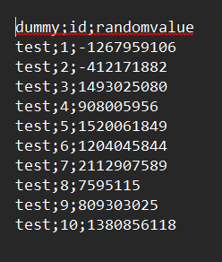

## Transform 4: Property Input con Add characters transformation

### 1. Input (Entrada)
Para esta transformación se utilizó el paso Property Input
* **Configuración técnica:** En la pestaña File se cargó el archivo de propiedades y en la pestaña Fields se utilizaron los nombres de las variables para mapear el contenido.
  
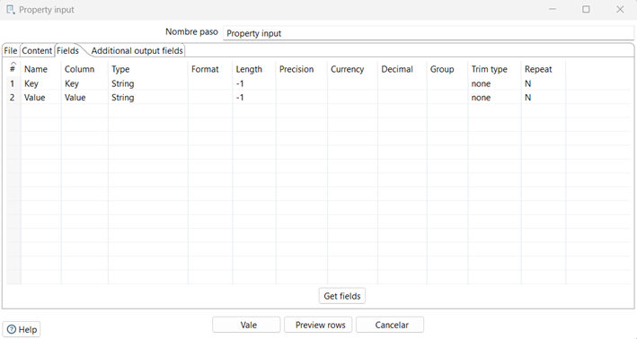
