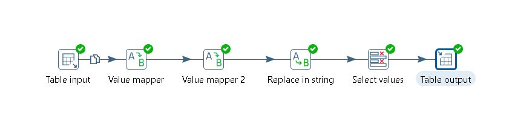
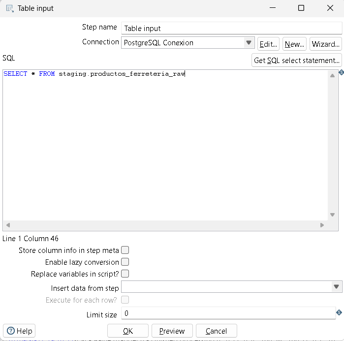
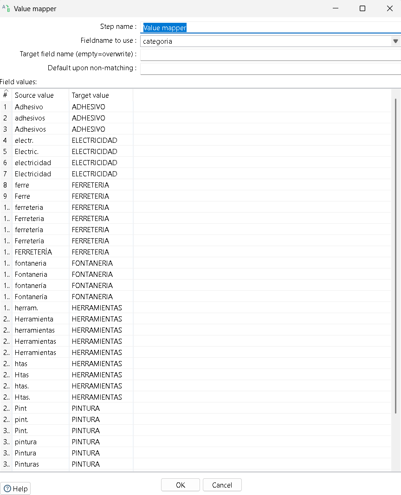
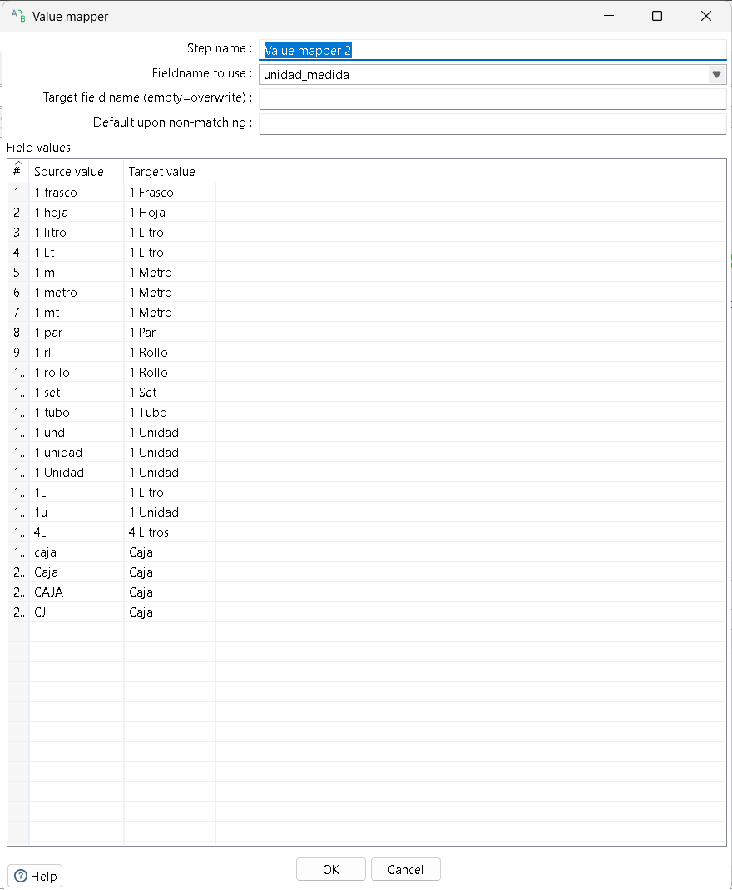
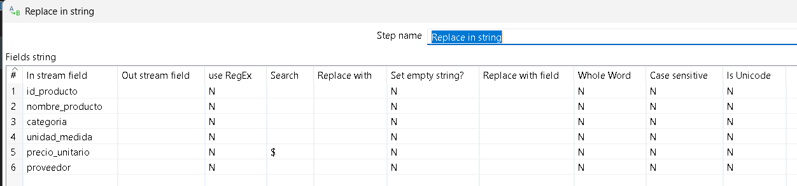
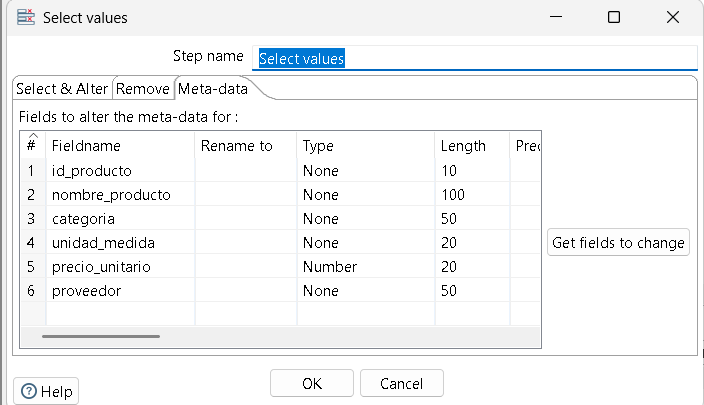
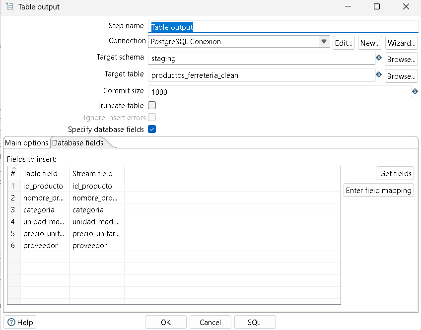
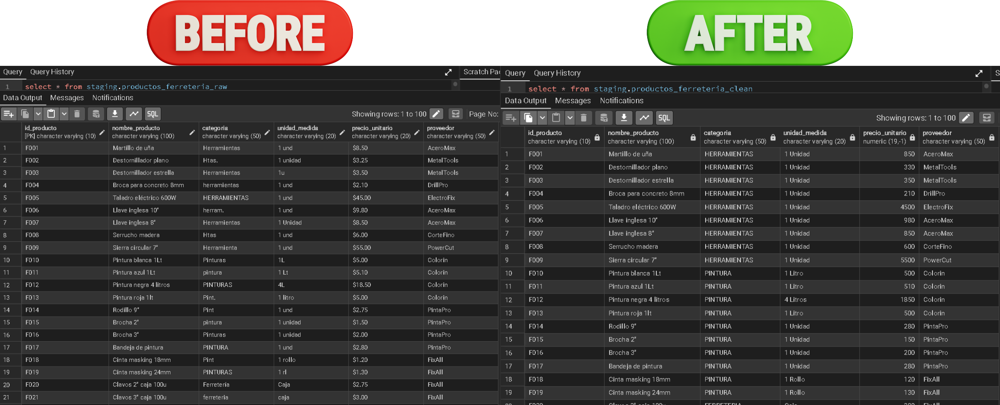

# Transformación ETL: Limpieza y Normalización del Catálogo "El Tornillo Feliz"

El siguiente proceso ETL fue diseñado para resolver los problemas de estandarización en los reportes de inventario de las sucursales, limpiando categorías, unidades de medida y formatos de precio para su inserción en una base de datos centralizada.

## 1. Input (Entrada)
Para la extracción de los datos crudos se utilizó el paso **Table input**.

* **Configuración técnica:** Se estableció la conexión a la base de datos PostgreSQL y se ejecutó la consulta SQL para extraer todos los registros de la tabla origen `staging.productos_ferreteria_raw`.

## 2. Transform (Transformación)
La fase de transformación consta de una secuencia lineal de 4 pasos encargados de limpiar la "basura" en los textos y arreglar los tipos de datos:

### 2.1 Estandarización de Categorías (Value mapper)
Se utilizó el primer paso **Value mapper** para uniformar el nombre de las categorías.
* **Configuración:** Se seleccionó el campo `categoria` y se dejó el campo de destino en blanco para sobrescribir los datos. Se mapearon los errores comunes hacia un valor único capitalizado (Ej: "Htas.", "herram." -> "HERRAMIENTAS" / "PINTURA", "Pint." -> "PINTURA").

### 2.2 Estandarización de Unidades (Value mapper 2)
Se agregó un segundo paso **Value mapper** para limpiar las unidades de medida.
* **Configuración:** Se seleccionó el campo `unidad_medida` sobrescribiendo el campo original. Se agruparon las variaciones bajo un estándar profesional (Ej: "1 und", "1u" -> "1 Unidad" / "1 Lt", "1L" -> "1 Litro" / "CJ", "caja" -> "Caja").

### 2.3 Limpieza del Precio (Replace in string)
Se utilizó el paso **Replace in string** para eliminar caracteres inválidos en los valores numéricos.
* **Configuración:** En el campo `precio_unitario` se buscó el símbolo de dólar (`$`) y se configuró su reemplazo por un espacio en blanco o vacío, dejando únicamente el número.

### 2.4 Conversión de Tipos (Select values)
Se utilizó el paso **Select values** para asegurar que la base de datos reciba el formato correcto.
* **Conversión de tipos:** En la pestaña *Meta-data*, se transformó el campo `precio_unitario`. Originalmente detectado como texto (String), se forzó a tipo numérico (**Number** / **BigNumber**) para permitir futuros cálculos matemáticos en la base de datos.

## 3. Output (Salida)
Como destino final del catálogo limpio, se configuró el paso **Table output**.

* **Carga de datos:** Se configuró la conexión a PostgreSQL apuntando a la tabla destino `staging.productos_ferreteria_clean`. Se habilitó la opción de *Truncate table* (opcional según el caso) y se mapearon los campos ya limpios y normalizados para su inserción.

## 4. Resultado
La transformación toma una tabla con registros manuales inconsistentes, estandariza las unidades y departamentos de la ferretería, transforma los precios de texto a números decimales y carga los datos limpios en una nueva tabla estructurada.

