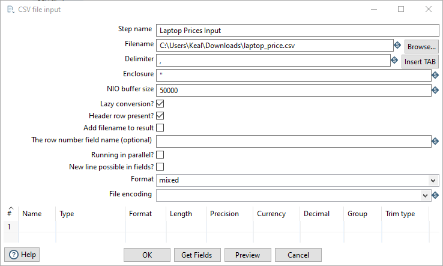
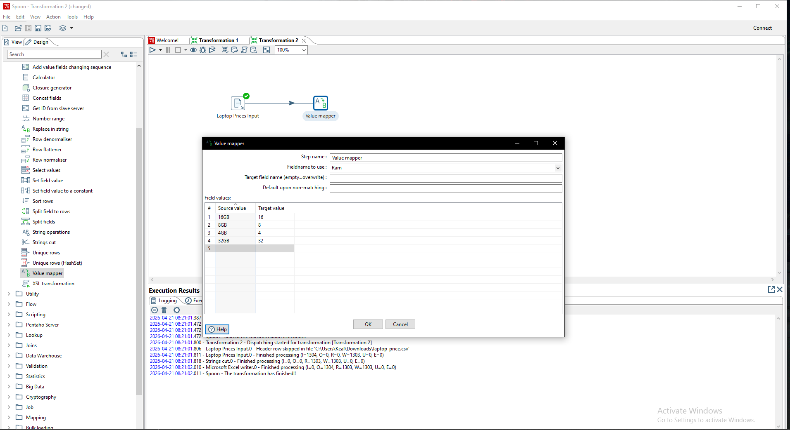
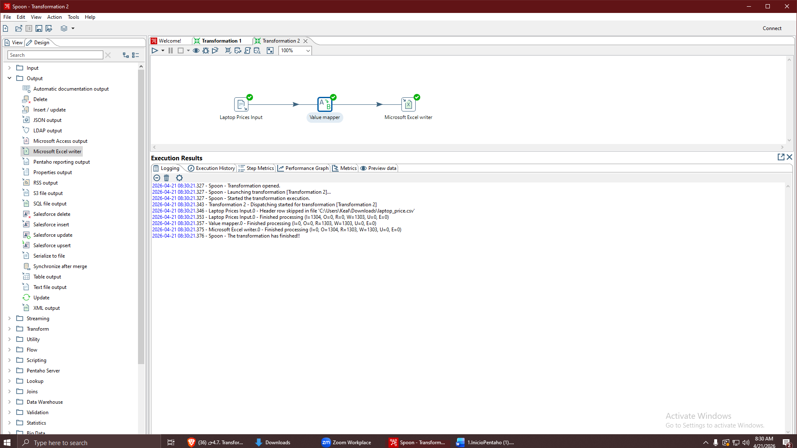
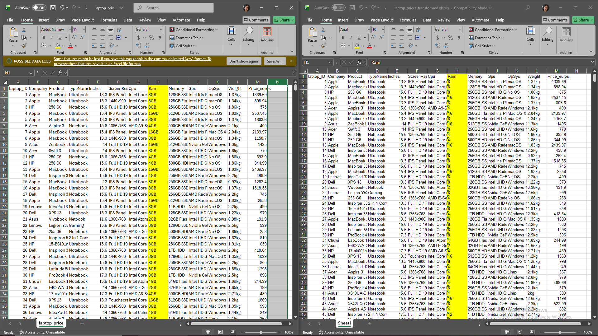

## CSV con mapper transformation

### 1. Carga de Archivo

Como primero paso, configuramos el input a que sea un archivo .csv, en este caso, es un archivo que contiene informacion de laptops.

### 2. Transformación (Mapper Transformation)

### 3. Salida (excel)
Comparación de los resultados

